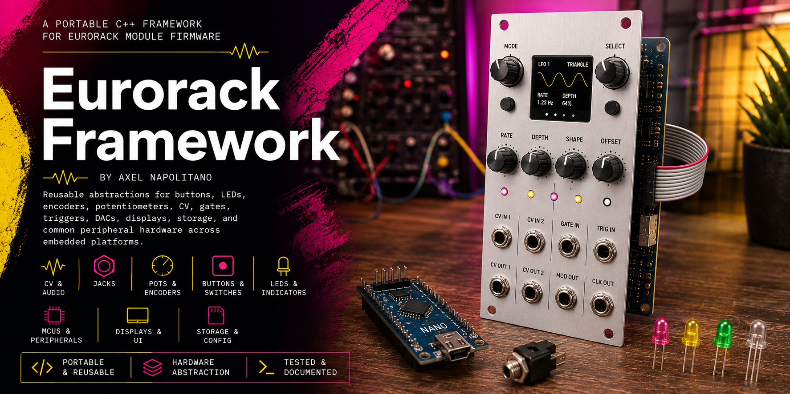
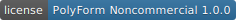
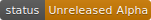

# Eurorack Framework

[](https://github.com/napolitano/eurorack-framework/actions/workflows/ci.yml)
[](https://github.com/napolitano/eurorack-framework/actions/workflows/tests.yml)
[](https://github.com/napolitano/eurorack-framework/actions/workflows/build.yml)
[](https://github.com/napolitano/eurorack-framework/actions/workflows/documentation.yml)
[](LICENSE)
[](docs/release/project-maturity.md)
[](https://en.cppreference.com/w/cpp/17)

## Purpose

Eurorack Framework is a reusable C++17 foundation for module firmware. It provides small,
explicit building blocks for recurring embedded tasks such as debounced controls, CV and gate
models, bus interfaces, peripheral drivers, display primitives, persistence, Arduino adapters,
and deterministic native simulation.

The framework deliberately does not implement complete musical applications. Quantizers,
sequencers, modulation algorithms, menu structures, and product-specific behavior remain in the
consuming firmware.

```text
Consuming module firmware
        |
        v
Selected framework components
        |
        v
Selected platform adapters and chip drivers
        |
        v
Protected and calibrated physical hardware
```

## Project maturity

**Status: Unreleased - Alpha**

Development artifact identifier: **0.1.0-alpha.25**

Public APIs, persistent formats, timing behavior, library boundaries, and hardware assumptions may
change without migration support. The framework has not yet completed qualification on every
advertised platform or peripheral. It is not production-ready and must not be treated as a stable
or safety-qualified dependency.

## Granular library model

The repository is a collection of independent PlatformIO libraries below `libraries/`. It is not a
single monolithic library. A firmware project selects only the exact elements it uses.

Examples:

- `eurorack-control-momentary-button` provides only the momentary-button model.
- `eurorack-control-rotary-encoder` provides only the rotary-encoder model.
- `eurorack-driver-mcp4922` provides only the MCP4922 driver.
- `eurorack-driver-dac8568` provides only the DAC8568 driver.
- `eurorack-driver-tlc5947` provides only the TLC5947 driver.
- `eurorack-platform-arduino-spi` provides only the Arduino SPI adapter.
- `eurorack-storage-crc32` provides only CRC-32.

Small shared contracts are separate libraries, for example `eurorack-compat`, `eurorack-core`,
`eurorack-io-spi`, `eurorack-io-result`, and `eurorack-drivers-led-interface`.

Compatibility meta-libraries such as `eurorack-controls`, `eurorack-display`,
`eurorack-drivers-dac`, and `eurorack-platform-arduino` remain available. They deliberately select
an entire category and are intended for migration, desktop development, or unconstrained targets.
Resource-constrained firmware should use the individual libraries.

Public include spellings remain stable:

```cpp
#include <eurorack/controls/momentary_button.hpp>
#include <eurorack/drivers/dac/mcp4922.hpp>
#include <eurorack/platform/arduino/arduino_spi.hpp>
```

Each public header has exactly one owning library. The obsolete duplicate root `include/` tree has
been removed to prevent divergent API copies.

## AVR and local-checkout integration

PlatformIO cannot reliably select several nested libraries from one bare Git URL. The supported
pattern is therefore a local clone or Git submodule and `lib_extra_dirs`.

```bash
git submodule add https://github.com/napolitano/eurorack-framework.git \
    lib/eurorack-framework
```

Minimal Arduino Nano R3 example using one control model and one DAC:

```ini
[env:nanoatmega328]
platform = atmelavr
board = nanoatmega328
framework = arduino

build_unflags = -std=gnu++11
build_flags =
    -std=gnu++17
    -Wall
    -Wextra
    -Wpedantic

lib_extra_dirs = lib/eurorack-framework/libraries
lib_ldf_mode = chain+
lib_deps =
    eurorack-control-analog-input
    eurorack-control-cv
    eurorack-driver-mcp4922
    eurorack-platform-arduino-gpio
    eurorack-platform-arduino-spi
```

Transitive requirements are declared by each component manifest. Do not list a category
meta-library merely for convenience on the ATmega328P; doing so intentionally makes all category
members eligible for compilation.

See the [AVR Integration Guide](docs/guides/avr-integration.md), the [generated framework map](docs/architecture/framework-map.md), the [resource ownership guide](docs/architecture/resource-ownership.md), and the [testing guide](docs/guides/testing-and-quality.md). The [TLC5947 guide](docs/guides/tlc5947.md) explains heap-free buffers, safe initialization, and selectable startup diagnostics.

## Repository structure

```text
libraries/
  eurorack-compat/                  Shared AVR standard-library shims
  eurorack-core/                    Framework-wide configuration contract
  eurorack-io-*/                    Individual hardware-neutral I/O contracts
  eurorack-control-*/               One panel-control model per library
  eurorack-display-*/               Individual display primitives and widgets
  eurorack-driver-*/                One concrete peripheral or chip per library
  eurorack-storage-*/               Individual persistence concerns and backends
  eurorack-platform-arduino-*/      One Arduino facility per library
  eurorack-simulation-*/            Individual native simulation facilities
  eurorack-controls/                Optional compatibility meta-library
  eurorack-display/                 Optional compatibility meta-library
  eurorack-drivers-*/               Optional category meta-libraries
  eurorack-storage/                 Optional compatibility meta-library
  eurorack-platform-arduino/        Optional Arduino umbrella/meta-library

examples/components/                Minimal native examples
examples/projects/                  Embedded reference projects
tests/native/                       Host-based unit tests
docs/                               Manual, architecture, guides, and release notes
tools/                              Validation, build, documentation, and artifact scripts
```

## Development environment

The supported development workflow is cross-platform and requires:

- Git
- Python 3.10 or newer
- PlatformIO Core 6.x
- GCC and/or Clang with C++17 support
- Doxygen 1.9 or newer
- Graphviz
- clang-format
- cppcheck

Create a Python environment:

Linux and macOS:

```bash
python3 -m venv .venv
source .venv/bin/activate
python -m pip install --upgrade pip platformio
```

Windows PowerShell:

```powershell
py -m venv .venv
.\.venv\Scripts\Activate.ps1
python -m pip install --upgrade pip platformio
```

Detailed installation and troubleshooting instructions are in
`docs/guides/development-environment.md`.

## Validation and builds

Validate library ownership, versions, and declared dependencies:

```bash
python tools/check-library-layout.py
```

Build every native component example against only its resolved dependency closure:

```bash
python tools/build-examples.py
```

Run every native test against only its resolved dependency closure:

```bash
python tools/run-native-tests.py --compiler g++
python tools/run-native-tests.py --compiler clang++
python tools/run-native-tests.py --compiler g++ --sanitizers
```

Run PlatformIO native tests:

```bash
pio test -e native
```

Build the Nano R3 reference projects:

```bash
pio run -d examples/projects/nano-r3-attenuverter
pio run -d examples/projects/nano-r3-oled-controller
```

The dependency-aware Python runners intentionally do not compile every framework implementation
for every test or example. This validates the manifests and makes accidental category-wide
coupling visible.

## Formatting and static analysis

Windows PowerShell:

```powershell
.\tools\format.ps1
.\tools\check-format.ps1
```

Cross-platform formatting:

```bash
find libraries tests examples -type f \
    \( -name '*.hpp' -o -name '*.h' -o -name '*.cpp' \) -print0 \
    | xargs -0 clang-format -i
```

Static analysis:

```bash
cppcheck \
    --enable=warning,performance,portability \
    --error-exitcode=1 \
    --std=c++17 \
    $(find libraries -maxdepth 2 -type d -name include -printf '-I%p ') \
    libraries
```

## Hardware documentation

Every concrete IC driver has a dedicated hardware page with device purpose, framework support, resource ownership, limitations, a C++ usage example and primary manufacturer references. Start at [`docs/hardware/index.md`](docs/hardware/index.md). The release preflight rejects concrete driver libraries without matching metadata and documentation.

## Documentation

Maintained documentation lives in:

```text
docs/manual/
docs/guides/
docs/architecture/
docs/release/
```

Start with `docs/manual/index.md`.

Run the documentation audits:

```bash
python tools/check-public-docs.py
python tools/check-maintainability-docs.py
python tools/check-doxygen-contracts.py
```

Build Markdown and PDF documentation:

```bash
python tools/build-documentation.py
```

Build the Markdown archive only:

```bash
python tools/build-documentation.py --markdown-only
```

## Release artifacts

```bash
python tools/build-artifacts.py
```

The script validates the source tree and creates deterministic source and documentation artifacts
plus SHA-256 checksums below `dist/`. Package versions are development identifiers while the project
remains Unreleased Alpha; creating an artifact does not constitute a stable release.

## Framework configuration

Framework-wide electrical and timing defaults are provided by `eurorack-core` through the public
header `eurorack_config.hpp`. A consuming project may replace it by defining
`EURORACK_FRAMEWORK_CONFIG_FILE` to an alternative header.

Every value must be reviewed against the actual circuit. Defaults are not substitutes for input
protection, output buffering, calibration, power-integrity design, or measurement.

## Major components

The current public API includes:

- buttons, switches, encoders, potentiometers, faders, and logical LED models
- CV, gate, trigger, analog-input, and jack models
- digital, analog, SPI, I2C, time, and result contracts
- MCP4922 and DAC8568 DAC drivers
- MCP23017 GPIO expansion
- TLC5916 and TLC5947 LED drivers
- 74HC165 and 74HC595 shift-register drivers
- binary-addressed analog multiplexer support
- SSD1306 and SH1106 display drivers
- monochrome canvas, geometry, drawing, glyph, text, and widget libraries
- persistent-storage interface, codecs, CRC, record store, and native backends
- individual Arduino GPIO, analog, SPI, I2C, time, and EEPROM adapters
- virtual I/O, virtual buses, virtual time, scenarios, and canvas export

## Real-time and electrical responsibility

The framework does not make arbitrary operations interrupt-safe or real-time-safe. Bus transfers,
file access, EEPROM access, dynamic containers in native-only facilities, and platform SDK calls may
block. Ownership, allocation, timing, and concurrency constraints are documented on the respective
APIs.

Microcontroller pins must not be connected directly to Eurorack jacks merely because an adapter
exposes a digital or analog method. Protection, attenuation, clamping, filtering, level shifting,
output buffering, short-circuit protection, power integrity, and calibration remain the
integrator's responsibility.

## Documentation map

- `docs/guides/avr-integration.md
- [`docs/guides/tlc5947.md`](docs/guides/tlc5947.md) explains heap-free buffers, safe initialization, and selectable startup diagnostics.` - granular AVR integration and library selection
- `docs/guides/development-environment.md` - toolchain setup
- `docs/guides/building-artifacts.md` - reproducible artifacts
- `docs/guides/framework-configuration.md` - compile-time configuration
- `docs/guides/examples.md` - example requirements
- `docs/architecture/framework-boundary.md` - project scope
- `docs/architecture/hardware-interfaces.md` - abstraction contracts
- `docs/architecture/persistence.md` - storage guarantees
- `docs/architecture/display-primitives.md` - canvas representation
- `docs/architecture/simulation.md` - deterministic native simulation
- `docs/release/project-maturity.md` - qualification status

## Licensing

The framework is source-available under the
[PolyForm Noncommercial License 1.0.0](LICENSE). Personal use, education, research, experimentation,
and other noncommercial use are permitted under its terms. Commercial exploitation requires prior
written permission.

The separate [Five-Unit Cost-Recovery Permission](ADDITIONAL_PERMISSION.md) defines a narrow
small-scale exception under its stated conditions. It is not a general commercial license.

Read the controlling documents:

- [LICENSE](LICENSE)
- [ADDITIONAL_PERMISSION.md](ADDITIONAL_PERMISSION.md)
- [COMMERCIAL_LICENSE.md](COMMERCIAL_LICENSE.md)
- [LICENSING.md](LICENSING.md)
- [NOTICE](NOTICE)

This is not an OSI-approved open-source license because commercial use is restricted.

## Author

**Axel Napolitano**  
Email: eurorack@skjt.de  
Canonical repository: https://github.com/napolitano/eurorack-framework

## Quantizer-oriented AVR building blocks

The granular package set now includes dedicated, opt-in libraries for `MCP4922`, `TLC5947`, an analog resistor-ladder button decoder, marker-last fixed persistent slots, the ATmega328P Timer2 1 kHz tick, an A5/A6/A7 interrupt-driven ADC scanner, and INT0/INT1 edge latches. None of these components is pulled into projects that do not declare it. The AVR hardware libraries intentionally target the Arduino Nano R3 / ATmega328P register layout.

## Architecture and quality maps

Generate the dependency map with `python tools/generate-framework-map.py`. Validate a project resource profile with `python tools/check-resource-conflicts.py <profile.json>`. Run the repository preflight with `python tools/release-check.py`.

New generic framework policies include fixed-capacity event queues, press gesture classification, soft takeover, and encoder acceleration. New independently selectable converters include MCP4822 and MCP3208.
